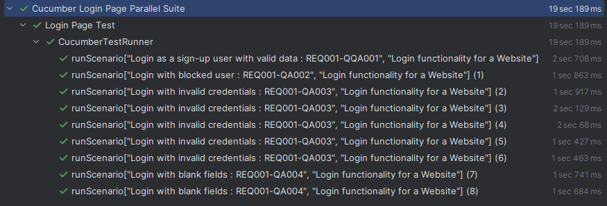
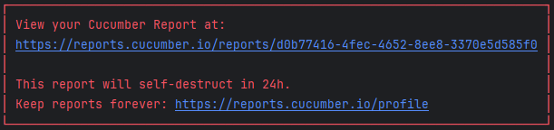
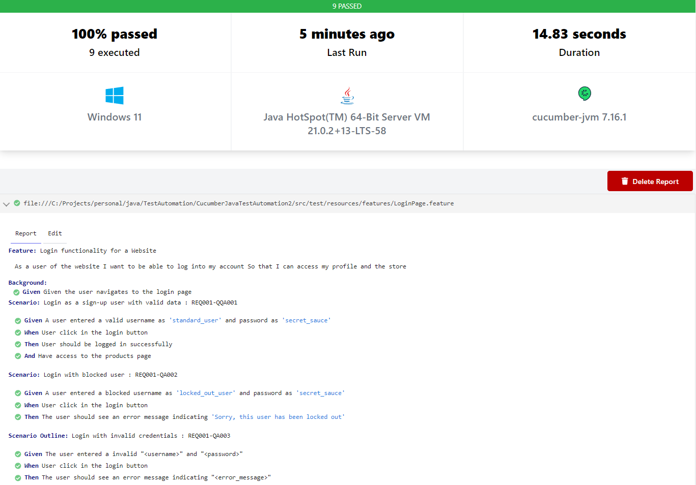

<!-- PROJECT LOGO -->
<div align="center">
  <h3 align="center">Cucumber Java Test Automation/</h3>
  
  <p>
    <a href="https://github.com/sschuckk/cucumber-java-test-automation//issues">Report Bug</a>
    ·
    <a href="https://github.com/sschuckk/cucumber-java-test-automation/">Request Feature</a>
  </p>
</div>

<!-- ABOUT THE PROJECT -->
## About The Project

The objective of this project is to develop basic Web Test Automation using Cucumber as a tool for writing tests in a BDD style (Behavior Driven Development). 
It also utilizes the POM (Page Object Model) design pattern with Selenium, which can make it easier to improve and update the tests.

This is a basic project. If you want to see a POM design with Page Factory, you can check out this other project: https://github.com/sschuckk/selenium-java-test-automation.


### Built With


<!-- GETTING STARTED -->
## Getting Started

### Prerequisites
* Git: https://git-scm.com/downloads
* Java: https://www.oracle.com/java/technologies/downloads/
* Maven: https://maven.apache.org/install.html

### Installation

#### Clone the repository to your machine.
   ```sh
   git clone https://github.com/sschuckk/cucumber-java-test-automation/
   ```


<!-- USAGE EXAMPLES -->
## Usage

The project can be run by a terminal or directly in your IDE.

In your terminal go to the project folder and run:

### Running the tests using Maven:

#### Basic execution:

   ```sh
   mvn test
   ```

#### Redirect the Maven terminal log to a file for debug purpose:

   ```sh
   mvn test --log-file ./target/mvn-test.log 
   ```


<!-- LOGS AND REPORTS -->

### Reports:

After the execution of all tests, a link will be provided where you can click to access an online report, as shown below:

